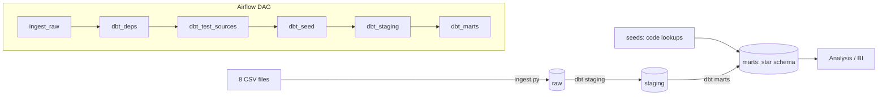

# Bank Transactions Data Warehouse

An end-to-end data warehouse for **1,056,320 bank transactions** from a Czech bank (1993–1998).
Raw CSV files are loaded into **DuckDB**, transformed into a **star schema** with **dbt**, validated by **45 automated tests**, and orchestrated by **Apache Airflow** (Astro).

![Airflow DAG]

---

## Architecture



| Layer | Purpose | Built by |
|---|---|---|
| **raw** | Exact copy of the source files, every column as text | `ingest.py` |
| **staging** | One model per source: rename, cast types, standardise missing values | dbt (views) |
| **seeds** | Code-to-label lookup tables (Czech codes → English labels) | dbt seed |
| **marts** | Dimensional model (star schema) for analysis | dbt (tables) |

## Tech stack

| Tool | Role |
|---|---|
| **Python** | Extract + Load (`ingest.py`) |
| **DuckDB** | Analytical (OLAP) warehouse, single file |
| **dbt** (`dbt-duckdb`, `dbt_utils`) | Transformations, tests, documentation |
| **Apache Airflow** (Astro CLI, Docker) | Orchestration |
| **Git / GitHub** | Version control |

---

## Data model

Star schema with one **transaction fact table** and four **dimensions**.


| Table | Type | Grain | Rows |
|---|---|---|---|
| `fact_transaction` | Transaction fact, atomic grain | one row per transaction | 1,056,320 |
| `dim_date` | Conformed, generated (date spine) | one row per day | 2,191 |
| `dim_account` | Conformed, SCD Type 1 | one row per account | 4,500 |
| `dim_district` | Conformed, SCD Type 0 | one row per district | 77 |
| `dim_transaction_profile` | Junk dimension | one row per type / operation / k_symbol combination | 15 |

### Fact measures

| Measure | Additivity | Meaning |
|---|---|---|
| `amount` | Additive | Transaction value (always positive in the source) |
| `signed_amount` | Additive | `+` for money in, `−` for money out; `SUM` = net flow |
| `balance_after` | **Semi-additive** | Account balance after the transaction; never summed across time |

### Key design decisions

- **Surrogate keys** are MD5 hashes of business keys (`dbt_utils.generate_surrogate_key`), so full rebuilds are idempotent and keys never drift.
- **Junk dimension:** `type`, `operation` and `k_symbol` are small code lists that only make sense together. One dimension with one key replaces three tiny dimensions and three joins.
- **Single source of truth for the sign:** the `direction` column (`CREDIT` / `DEBIT`) in `dim_transaction_profile` decides whether money enters or leaves an account; the fact derives `signed_amount` from it.
- **Coded values are never replaced:** every Czech code is kept next to its English label (`POPLATEK MESICNE` → `Monthly`), with labels stored as version-controlled dbt seeds rather than hard-coded `CASE` statements.
- **Raw is loaded as text:** all type casting happens in dbt staging, where it is visible, documented and tested.
- **Branch district on the fact:** district is the main analysis axis, so it is one join away from every transaction.

---

## Data quality

Every rule below came from profiling the source data before modelling.

| Finding | Evidence | Decision |
|---|---|---|
| Undocumented transaction type `VYBER` | 16,666 rows, all cash withdrawals | Classified as `DEBIT` |
| Missing `k_symbol` in two forms | 481,881 NULL + 53,433 whitespace | Unified to `N/A` |
| Missing `operation` | 183,114 rows, all interest credited by the bank | Expected; set to `N/A` |
| Partner account `0` | 21,881 rows | Not a real account → NULL |
| `?` in district statistics | 1 district (Jesenik) in two columns | NULL, not 0; a test ensures no other district is affected |
| Dates stored as `YYMMDD` | 0 parse failures | Converted explicitly as `1900 + YY` (no century guessing) |

### Tests

**45 dbt tests** run on every pipeline execution, including:

- `unique` / `not_null` on every business and surrogate key
- `relationships`: every foreign key in the fact exists in its dimension
- `accepted_values` on coded columns (an unmapped new code fails the build)
- **Row-count reconciliation:** `fact_transaction` must contain exactly as many rows as `raw.trans`
- Ingestion validates row counts of all 8 files against the dataset documentation and exits with a non-zero code on any mismatch, which stops the Airflow run

### Reconciliation check

Every account starts at a zero balance, so the sum of `signed_amount` per account should equal its final balance:

| | Value |
|---|---|
| Sum of `signed_amount` | 197,151,288.70 |
| Sum of final account balances | 197,140,234.20 |
| Difference | 0.006% |

The residual differences are 0.1–0.5 per account and come from rounding in the source data. A wrong sign rule (for example treating `VYBER` as a credit) would produce a difference in the millions.

---

## Example insight

Net money flow per year:

```sql
select d.year,
       count(*)             as transactions,
       sum(f.signed_amount) as net_flow
from marts.fact_transaction f
join marts.dim_date d on f.transaction_date_key = d.date_key
group by d.year
order by d.year;
```

| Year | Transactions | Net flow |
|---|---|---|
| 1993 | 28,205 | 36,575,946.1 |
| 1994 | 91,628 | 18,279,978.0 |
| 1995 | 133,022 | 24,404,026.1 |
| 1996 | 196,779 | 49,690,489.1 |
| 1997 | 284,409 | 41,055,642.3 |
| 1998 | 322,277 | 27,145,207.1 |

Transaction volume grew more than 11× in six years. Net flow is positive every year: clients deposited more than they withdrew.

---

## Project structure

```
├── dags/
│   └── berka_pipeline.py        # Airflow DAG
├── include/
│   ├── ingestion_raw/
│   │   └── ingest.py            # CSV -> DuckDB raw schema
│   ├── berka_dbt/               # dbt project
│   │   ├── models/
│   │   │   ├── staging/         # stg_account, stg_district, stg_trans + sources & tests
│   │   │   └── marts/           # 4 dimensions + fact_transaction + tests
│   │   ├── seeds/               # code -> label lookups
│   │   ├── macros/              # date conversion, missing-value cleaning, schema naming
│   │   └── tests/               # custom data tests
│   ├── data/raw/                # source CSVs (not in Git)
│   └── warehouse/               # berka.duckdb (not in Git)
├── docs/                        # screenshots and model documentation
├── Dockerfile                   # Airflow image + dbt in its own virtualenv
└── requirements-dev.txt         # local development environment
```

---

## How to run

**Data:** download the Berka dataset (the 8 CSV files: `account`, `card`, `client`, `disp`, `district`, `loan`, `order`, `trans`) and place them in `include/data/raw/`.

### Option 1: Airflow (full pipeline)

Requires Docker and the [Astro CLI](https://www.astronomer.io/docs/astro/cli/install-cli).

```bash
astro dev start
```

Open the Airflow UI, then trigger the `berka_pipeline` DAG.

### Option 2: locally

```bash
python -m venv .venv
# Windows: .venv\Scripts\Activate.ps1   |   Mac/Linux: source .venv/bin/activate
pip install -r requirements-dev.txt

python include/ingestion_raw/ingest.py

cd include/berka_dbt
dbt deps
dbt build                 # seeds + models + tests
dbt docs generate && dbt docs serve --port 8081
```

---

## Future work

- **Monthly balance snapshot** (periodic snapshot fact): one row per account per month, to answer balance questions over time correctly, since `balance_after` is semi-additive
- **Loans and cards stars** reusing the conformed `dim_account`, `dim_district` and `dim_date`
- Pipeline run audit table and failure alerts (email / Slack)

---

**Author:** Donia